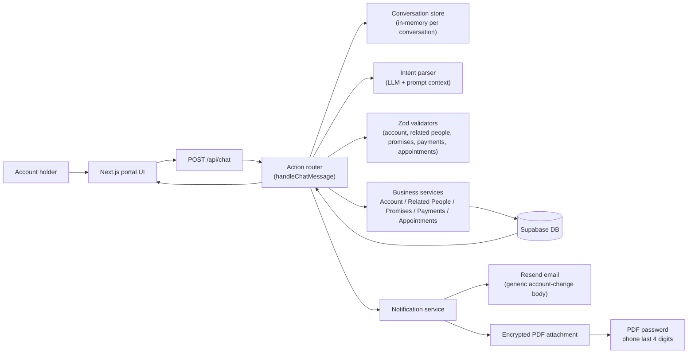

# Architecture Diagram

This flow reflects the implemented chat experience in the project: the UI sends a message to the chat API, the router parses the intent, validates the extracted fields, executes the relevant service, writes to Supabase where needed, and optionally queues a notification containing an encrypted PDF summary.
